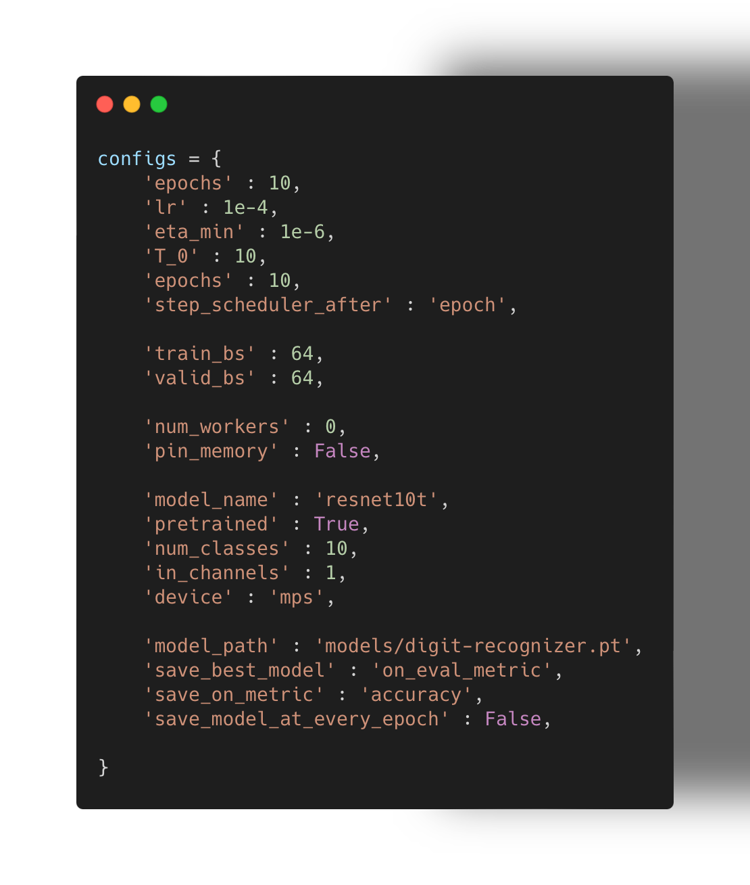
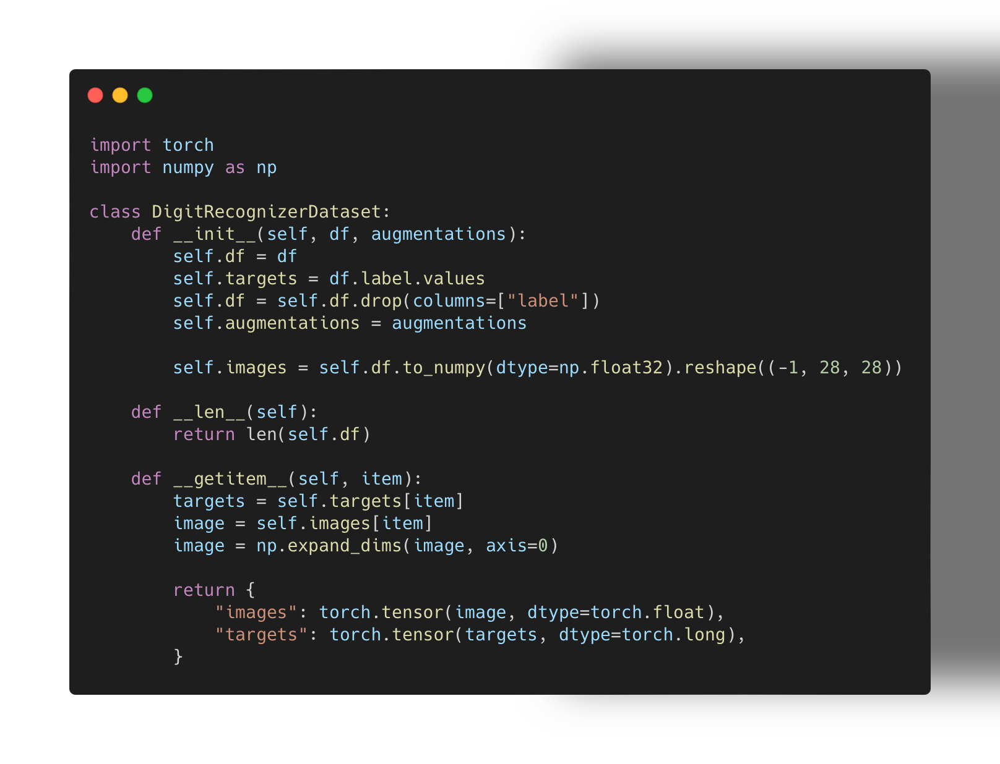
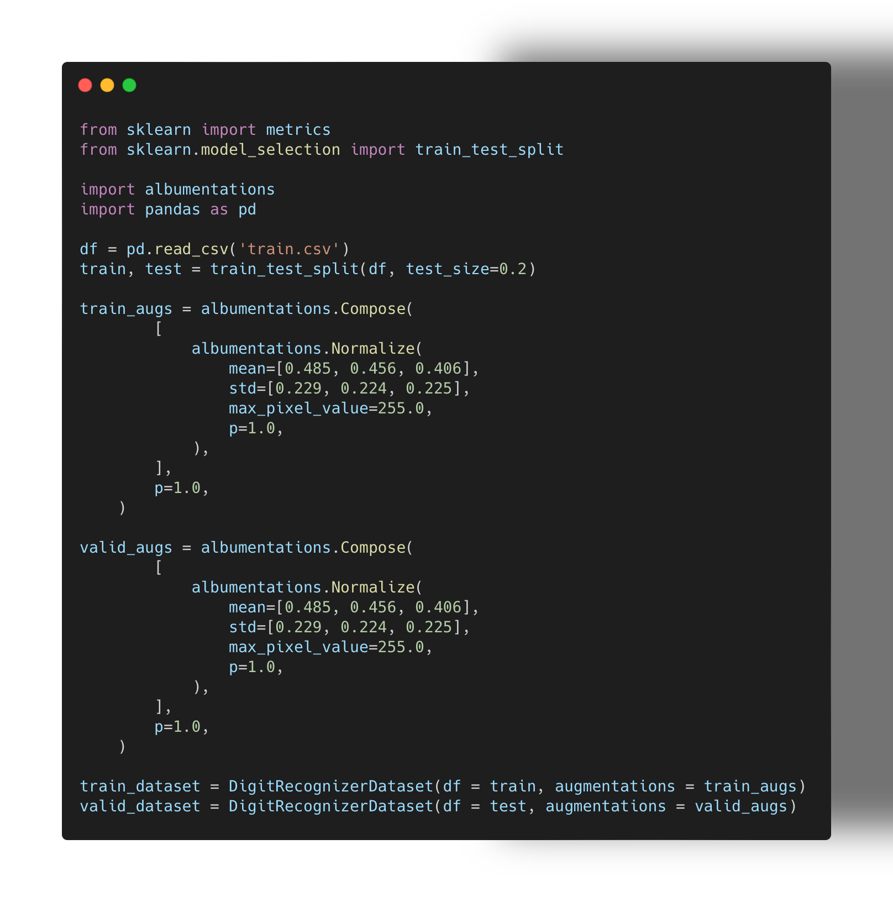
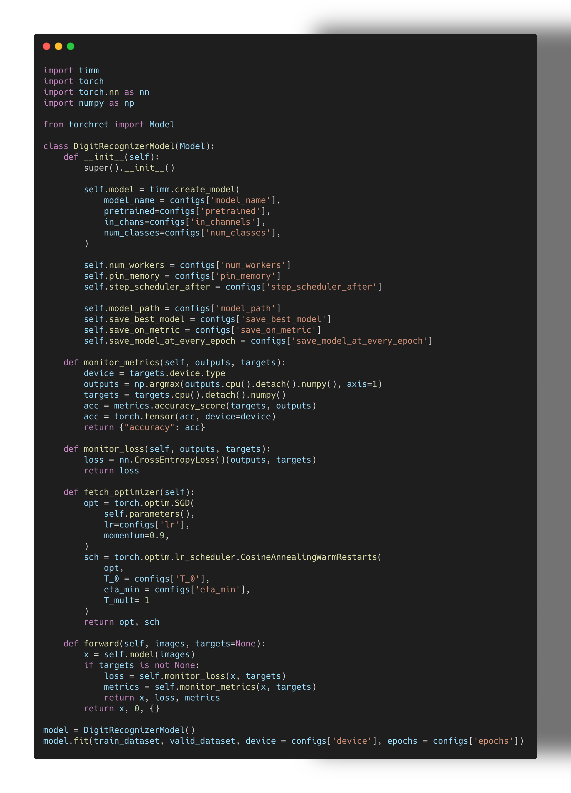

# TorchRet: PyTorch Trainer for Research Experiments

TorchRet is a flexible and customizable PyTorch trainer designed to facilitate academic research experiments in deep learning. It provides a comprehensive framework for easily implementing and experimenting with various research methodologies, including but not limited to cutmix, mixup, progressive learning, and more.

## Features

- **Flexible Model Definition**: Define your neural network models with ease using PyTorch's nn.Module class.

- **Configurable Training Loop**: Easily configure and customize the training loop to suit your specific research requirements.

- **Data Augmentation Techniques**: Incorporate popular data augmentation techniques such as cutmix and mixup seamlessly into your training pipeline.

- **Dynamic Learning Rate Scheduling**: Utilize PyTorch's learning rate schedulers to dynamically adjust learning rates during training.

- **Efficient Data Handling**: Leverage PyTorch's DataLoader for efficient loading of datasets and batching during training, validation, and prediction.

- **Mixed Precision Training**: Enable mixed precision training with automatic gradient scaling using PyTorch's GradScaler.

- **Model Checkpointing**: Save and load model checkpoints with support for saving model weights, optimizer states, scheduler states, and more.

## Example

# Setup Configuration

# Create Dataset

# Create train valid split

# Create model class and run the model

# Output logs

100%|████████████████████████████| 525/525 [04:31<00:00,  1.93it/s, accuracy=0.553, current_lr=0.0001, epoch=1, loss=1.400170, stage=train]

100%|████████████████████████████████████████████████| 132/132 [00:48<00:00,  2.72it/s, accuracy=0.797, epoch=1, loss=0.726667, stage=eval]

Model Saved at models/digit-recognizer.pt
Model was saved based on_eval_metric with 0.7972301136363636 accuracy

100%|███████████████████████████| 525/525 [04:50<00:00,  1.81it/s, accuracy=0.843, current_lr=9.76e-5, epoch=2, loss=0.561076, stage=train]

100%|████████████████████████████████████████████████| 132/132 [00:52<00:00,  2.50it/s, accuracy=0.892, epoch=2, loss=0.387058, stage=eval]
