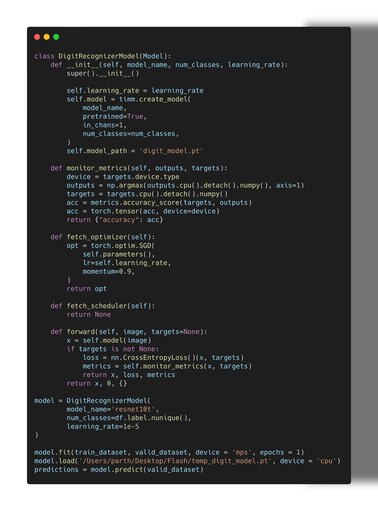

# TorchRet: PyTorch Trainer for Research Experiments

TorchRet is a flexible and customizable PyTorch trainer designed to facilitate academic research experiments in deep learning. It provides a comprehensive framework for easily implementing and experimenting with various research methodologies, including but not limited to cutmix, mixup, progressive learning, and more.

## Features

- **Flexible Model Definition**: Define your neural network models with ease using PyTorch's nn.Module class.

- **Configurable Training Loop**: Easily configure and customize the training loop to suit your specific research requirements.

- **Data Augmentation Techniques**: Incorporate popular data augmentation techniques such as cutmix and mixup seamlessly into your training pipeline.

- **Dynamic Learning Rate Scheduling**: Utilize PyTorch's learning rate schedulers to dynamically adjust learning rates during training.

- **Efficient Data Handling**: Leverage PyTorch's DataLoader for efficient loading of datasets and batching during training, validation, and prediction.

- **Mixed Precision Training**: Enable mixed precision training with automatic gradient scaling using PyTorch's GradScaler.

- **Model Checkpointing**: Save and load model checkpoints with support for saving model weights, optimizer states, scheduler states, and more.

## Installation

# TorchReT
